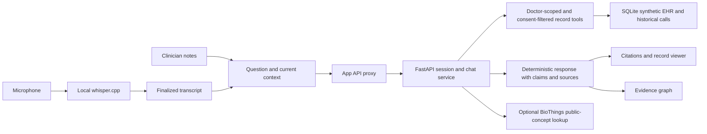

<p align="center">
  
</p>

# Hippacampus · A second brain for the clinician

**Remember the conversation. Connect the history. Keep the clinician in control.**

The chart holds what was documented. The conversation holds the detail that may never make it into the chart. Hippacampus brings working notes, captured speech, and historical patient records into one quiet workspace, so clinicians can ask a question and trace the answer back to its source.

During a consultation, write your own notes and ask for context when you need it. Afterward, revisit what was said, prepare drafts, and organize follow-up. Across the synthetic practice, explore a defined patient cohort using structured history.

**Clinician-led memory · Cited evidence · Consent-aware retrieval · Local-first prototype**

[The Maria demo](#the-maria-demo) · [Visual tour](#visual-tour) · [Capabilities](#capabilities-on-main) · [Privacy and HIPAA](#privacy-and-hipaa) · [Run locally](#first-time-setup)

> **Prototype status:** This is a hackathon demonstration using fictional patients and records. HIPAA compliance is a requirement for future clinical deployment, not a verified property of this prototype. Use synthetic data only.


_The product experience: capture your thoughts, ask for context, inspect the evidence. Images in this README are real captures of the [showcase branch](https://github.com/Yoha02/HIPAAcampus/tree/feature/clinical-workspace-showcase), not screenshots of the current `main` build. Main has a newer backend and different controls, including Insights and Consent; the capability table below describes main._

## A second brain that follows the clinician's questions

- **Remember across encounters.** Recover a patient's earlier words alongside written notes and structured measurements.
- **Keep your thinking space.** The notes editor belongs to the clinician. Questions and on-demand Insights are separate from the draft.
- **Make evidence inspectable.** Move from an answer to its source card, dated record, or timestamped conversation. The graph connects claims to supporting evidence.
- **Carry the visit forward.** Prepare a referral draft, a plain-language Italian explanation, or a local follow-up task for review.
- **Respect the patient's context.** Demo record retrieval is scoped to the configured doctor and filtered by patient consent categories.

The central interaction is **ask → read → verify → decide**. The clinician interprets the evidence and makes clinical decisions.

## The Maria demo

Maria Conti is a fictional 58-year-old retired schoolteacher with recently diagnosed diabetes. Her weight has fallen from 78 kg to 66 kg. She stopped metformin, and the June chart entry records only **“GI intolerance.”** At today's visit, the clinician enters or captures new yellowing of her eyes.

The doctor asks: **“Why did Maria stop metformin?”**

The historical June conversation contains the missing context: she stopped around mid-May, described pale, greasy stools, and said the symptoms had continued after stopping the medication. She also mentioned reduced appetite and back pain she attributed to gardening. Hippacampus retrieves the spoken evidence with its source, so the clinician can compare it with the sparse written note.

**The demonstration's pivotal moment:** click the citation and inspect the original June passage. The tool recovers context; the clinician connects the clues.

| Ask during or after the visit                                                                                                      | What the demo is designed to demonstrate                                                    |
| ---------------------------------------------------------------------------------------------------------------------------------- | ------------------------------------------------------------------------------------------- |
| “What's changed since her last visit?”                                                                                             | Compare historical evidence with the current context supplied by the clinician.             |
| “Why did Maria stop metformin?”                                                                                                    | Recover the medication discussion and distinguish spoken detail from the chart entry.       |
| “Has her weight changed, and did she say why?”                                                                                     | Inspect measurements and the historical explanation about diet and appetite.                |
| “Did she ever mention back or abdominal pain?”                                                                                     | Retrieve the relevant historical dialogue with citations.                                   |
| “What did I tell her today about the tests?”                                                                                       | Use finalized current speech; identify an evidence gap when it is absent.                   |
| “Draft an urgent referral for a pancreas-protocol CT including the relevant history.”                                              | Prepare the supported demo referral draft for clinician review; nothing is sent or ordered. |
| “Write a summary for Maria in plain Italian explaining the next steps.”                                                            | Show a scenario-specific patient explanation draft.                                         |
| “What could I improve about how I explained the visit?”                                                                            | Demonstrate communication/process feedback, not a validated doctor rating.                  |
| “Add a follow-up: bilirubin, liver panel, lipase, CA 19-9 results by Thursday.”                                                    | Create a local demo task, without an external reminder or laboratory integration.           |
| “Which of my patients over 50 were diagnosed with diabetes in the last two years and have lost more than 5% of their body weight?” | Exercise the fixed, doctor-scoped cohort query over synthetic records.                      |

These are bounded demonstration workflows. Local answers and drafts are deterministic; they are not evidence of general clinical reasoning or diagnostic accuracy. Cohort filtering currently uses inclusive thresholds (age **at least 50**, weight loss **at least 5%**) and a fixed diagnosis cutoff of **26 September 2024**.

## Visual tour

The following captures illustrate the notes-first experience from the showcase branch. The images are pinned to a specific commit so this README can display them without adding files or merging application code into `main`.

### 1. A quiet space for the clinician's own notes

The main canvas keeps observations and working thoughts at the centre. Chat and evidence stay available on demand.


**Example:** record today's observations, then ask how they compare with previous visits. On main, Notes starts blank and remains separate from transcript-derived Insights.

### 2. An answer with an inspectable source

Questions bring together current notes, finalized speech, and available historical records. Citations lead back to the original material.


**Example:** verify that symptoms persisted after metformin was stopped, then read the surrounding conversation.

### 3. Connections across the patient's history

The graph is a view of evidence provenance: which claims and sources support the answer. Selecting a source returns the clinician to the record. Main displays claim/source nodes and their relationships; the showcase capture below uses the compact visual node layout.


**Example:** compare a dated weight measurement with the separate conversation in which Maria explained her diet and appetite. A connection does not establish clinical causation.

### 4. Records and conversations, side by side

The source panel preserves the distinction between written chart entries and captured speech.


**Example:** compare the brief June note with the fuller call transcript. Main retrieves sources through its doctor-scoped, consent-filtered record service.

### 5. Local speech capture during the consultation

The microphone interface supports local whisper.cpp transcription, timestamped segments, search and WebVTT export. The screenshot shows the unrecorded state, not a live transcription test.


**Example:** capture an acted consultation, then ask what was said about follow-up. The microphone does not automatically capture the remote side of a telehealth call or identify speakers.

### 6. Evidence that remains accessible on a narrow screen

The source panel becomes a full-width overlay on smaller screens. The showcase graph demonstrates how sources can remain within reach without adding a second dashboard.

<p align="center">
  
</p>

<details>
<summary><strong>Additional showcase views — recap, import and connector concepts</strong></summary>

These views belong to the showcase build. They do not imply that its importer or connector picker is present on main. Main's **Insights** tab extracts cited bullets from finalized live speech, rather than using the showcase's notes-based Summary.


Epic, Oracle Health, Teams, UpToDate and PubMed are interface concepts in these captures, not connected production systems.

</details>

## Capabilities on main

| Area                 | Current implementation and boundary                                                                                                                              |
| -------------------- | ---------------------------------------------------------------------------------------------------------------------------------------------------------------- |
| Notes and chat       | Clinician-owned rich text; the current draft accompanies each submitted question.                                                                                |
| Insights             | On-demand cited extraction from finalized live transcript segments; separate from Notes.                                                                         |
| Historical memory    | Seeded Maria case and a deterministic 17-patient fixture; SQLite emulates the record system.                                                                     |
| Evidence             | Source cards, exact historical passages, and a deterministic claim-to-evidence graph.                                                                            |
| Consent              | General, behavioral-health and medication category flags filter historical record retrieval; affected prior answers are marked unavailable on session retrieval. |
| Doctor scope         | Record access is restricted to the configured doctor's synthetic panel. This is demo scoping, not production user authentication.                                |
| Post-visit workflows | Bounded referral and Italian-summary drafts, process coaching, and local-only tasks.                                                                             |
| Cohort query         | Fixed structured filters over the current doctor's permitted synthetic panel.                                                                                    |
| Transcription        | Existing local microphone-to-whisper.cpp path; requires its separate server.                                                                                     |
| BioThings Explorer   | Bounded TRAPI adapter sends allowlisted public concept IDs, with explicit result status. It does not send patient text.                                          |
| Bedrock              | Optional `converse` adapter exists. The current chat route remains deterministic; a configured provider status does not mean chat invokes a live model.          |
| External actions     | No live EHR writeback, test ordering, referral delivery or messaging.                                                                                            |

## Privacy and HIPAA

**The product direction is a clinician's second brain built for confidential care. The current repository is a synthetic-data prototype, not a verified HIPAA-compliant deployment.**

The demo already explores several useful boundaries: local record storage and speech processing, configured doctor/patient scoping, category-based consent filtering, read-only record tools, and explicit source provenance. BioThings requests use public concept identifiers rather than patient notes. These choices are architectural foundations, not a compliance determination.

HIPAA compliance depends on the deployed system and the operating organization, including risk analysis, appropriate safeguards, and applicable business associate agreements. HHS describes these responsibilities in its [Security Rule summary](https://www.hhs.gov/hipaa/for-professionals/security/laws-regulations/index.html) and [cloud computing guidance](https://www.hhs.gov/hipaa/for-professionals/special-topics/health-information-technology/cloud-computing/index.html).

Before real patient use, the deployment would need assessed identity and access controls, auditability, appropriate encryption and key management, retention and deletion policies, operational safeguards, incident response, and any required vendor agreements. Local operation and consent toggles alone do not establish compliance. The demo's category flags are application controls, not a complete implementation of HIPAA permissions or authorizations.

**For this hackathon: use fictional data, keep external actions under clinician control, and make every retrieved claim inspectable.**

## How the second brain works



The record tools also expose a separately runnable MCP stdio server. The browser talks to the application API; it does not receive direct database or MCP access. The optional Bedrock adapter is separate from the current deterministic answer path.

## First-time setup

Requirements: Node.js 22.12 or newer and Python 3.10 or newer. The supplied scripts use Bash and Unix-style virtual-environment paths. On macOS, local Whisper also needs Xcode Command Line Tools; Windows requires a compatible environment or adapted local setup.

```sh
git clone --branch main https://github.com/Yoha02/HIPAAcampus.git
cd HIPAAcampus
npm install
npm run backend:setup
npm run backend:seed
```

For microphone transcription, initialize and build the existing pinned whisper.cpp service:

```sh
git submodule update --init
npm run whisper:setup
```

Whisper models/build products and the generated SQLite database are local ignored artifacts. The
version-controlled fixture remains the source of truth.

## Run

Run the complete app, including local transcription:

```sh
npm run dev:all
```

Then open [http://localhost:8080](http://localhost:8080).

For the app without Whisper (notes, records, chat, consent, and graph still work):

```sh
npm run dev:demo
```

Individual processes:

```sh
npm run backend:dev     # FastAPI on http://127.0.0.1:8000
npm run whisper:server  # whisper.cpp on http://127.0.0.1:8178
npm run dev             # TanStack app on http://localhost:8080
```

## Reset, seed, and test

Use **Reset demo** in the UI to clear the current session, local tasks, and chat, return Notes to a blank draft, and restore consent through that explicit control.

To recreate all historical data:

```sh
npm run backend:validate
npm run backend:seed
```

To verify the implementation:

```sh
npm run backend:test
npm run lint
npm run build
```

## Canonical demo

Maria is selected on startup and the Notes tab starts blank. For the current-visit demo, type the
66 kg weight, yellow eyes, and investigation plan into Notes or capture them in the live transcript.

1. Ask `What's changed since her last visit?`
2. Ask `Why did Maria stop metformin?`, click a citation, and show the June 4 spoken-only excerpt.
3. Ask `Has her weight changed, and did she say why?`
4. Ask `Did she ever mention back or abdominal pain?`
5. Ask an absent fact and show the explicit evidence gap.
6. Ask for the urgent CT referral draft, plain-Italian summary, today’s test discussion, coaching,
   and the local follow-up.
7. Ask `Which of my patients over 50 were diagnosed with diabetes in the last two years and have
lost more than 5% of their body weight?`
8. In **Consent**, revoke `Medications`, repeat the metformin question, and show that the details and
   source cards are no longer returned. Use **Reset demo** to restore consent.

No flow orders a test, sends a referral/message, writes to an EHR, or asserts pancreatic cancer.

## Data and backend layout

- `backend/fixtures/synthetic_records.json`: deterministic 17-patient fixture, including Maria and
  second-doctor negative fixtures.
- `backend/app/schema.sql`: SQLite schema, constraints, and indexes.
- `backend/app/seed.py`: reproducible seed and validation command.
- `backend/app/records.py`: doctor-scoped, consent-filtered record tools.
- `backend/app/mcp_server.py`: official Python MCP stdio server.
- `backend/app/main.py`: FastAPI sessions, chat, consent, task, reset, and health routes.
- `backend/tests`: direct record and end-to-end API tests.

The FastAPI service uses the same record-tool implementation in process, so it remains the trusted
MCP client boundary without exposing a browser-to-MCP or browser-to-SQL route. The stdio MCP server
is available for direct tool testing:

```sh
PYTHONPATH=backend backend/.venv/bin/python -m app.mcp_server
```

## Provider modes

Copy `.env.example` values into your shell or local environment as needed.

- **Model:** `HIPAACAMPUS_MODEL_MODE=local` is the deterministic demo default. To configure the available Bedrock adapter, set
  `HIPAACAMPUS_MODEL_MODE=bedrock`, the workshop’s exact `BEDROCK_MODEL_ID`, AWS region, and normal
  AWS credentials. No model ID is invented in code. The current chat route does not call this adapter; configuration alone does not enable model-generated chat.
- **BioThings Explorer:** the adapter targets the current documented production TRAPI route,
  `https://api.bte.ncats.io/v1/query`. Results are labelled `live`, `cached`, `unavailable`,
  `no_match`, `mocked`, or `not_requested`. Patient data is never included.
- **Transcription:** browser microphone audio is downsampled to 16 kHz mono WAV and sent to the local
  whisper.cpp server. This captures the selected microphone, not automatically the remote side of a
  telehealth call, and it does not perform speaker diarization.

## License

[MIT](LICENSE). Dependencies, including whisper.cpp, retain their own licenses.
