<p align="center">
  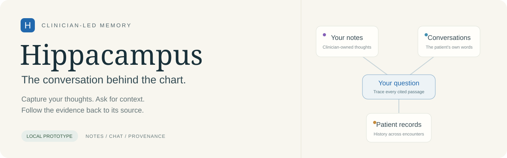
</p>

# Hippacampus

**A quiet workspace for clinical notes, questions, and the evidence behind an answer.**

Hippacampus brings the clinician's working notes, captured conversation, and a patient's historical records into one consultation workspace. Ask a question when you need context. Read the original words behind the response. Follow the connections back to the chart.

**Local hackathon prototype · Synthetic patient data · Source-linked answers · MIT license**

[Visual tour](#visual-tour) · [Try the demo](#the-demo-why-did-she-stop-metformin) · [Run locally](#run-locally) · [Architecture](#how-it-works) · [Feature status](#what-works-today)

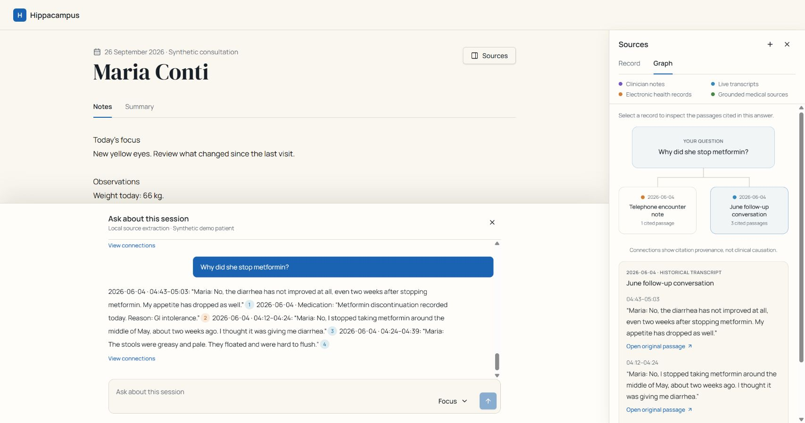

_One workspace, three jobs: capture your thoughts, ask for context, and inspect the evidence. The right panel opens on demand._

## The demo: “Why did she stop metformin?”

Maria Conti is a fictional 58-year-old patient returning with new yellow eyes. Her records show diabetes diagnosed in October 2025 and weight falling from 78 kg to 66 kg. The June encounter note records metformin discontinuation with a brief reason: **“GI intolerance.”**

The historical call contains much more detail. Maria described greasy, pale stools; said the diarrhea had not improved two weeks after stopping metformin; and mentioned reduced appetite. Elsewhere in the call, she described back pain between her shoulder blades, which she attributed to gardening.

Hippacampus retrieves those original passages, with citations. The clinician can compare them with the written note and decide what to do next.

| Ask                                              | What the local demo retrieves                                                                                                                     |
| ------------------------------------------------ | ------------------------------------------------------------------------------------------------------------------------------------------------- |
| **Why did she stop metformin?**                  | The June transcript's approximate mid-May cessation, stool description, persistent symptoms and reduced appetite, alongside the brief EHR entry.  |
| **Has her weight changed, and did she say why?** | The dated 78 → 72 → 68 → 66 kg measurements; a calculated 12 kg / 15.38% decline; and Maria's February explanation about diet and lower appetite. |
| **Did she ever mention back or abdominal pain?** | The June passage about back pain between the shoulder blades and gardening. The excerpt retains the patient's actual wording.                     |
| **What's changed since her last visit?**         | June and current-visit evidence, including the 68 → 66 kg change and new yellow eyes. The June weight is labelled patient-reported.               |
| **What is in my notes?**                         | The current draft, captured as an immutable source for that answer.                                                                               |
| **What did I tell her today about the tests?**   | Relevant captured speech from today, when available. A historical plan or unspoken script is not substituted for today's conversation.            |

**The central interaction:** question → citation → highlighted transcript → source graph. The tool retrieves evidence; it does not diagnose Maria.

For a presentation sequence, see the [five-minute demo guide](docs/DEMO.md).

## Visual tour

### 1. Notes stay at the centre

The main editor is the clinician's own space. Capture observations, questions and working thoughts. Use the formatting menu and keyboard shortcuts for headings, emphasis and lists. Switching between Notes and Summary preserves the open draft; text is saved locally in the browser.

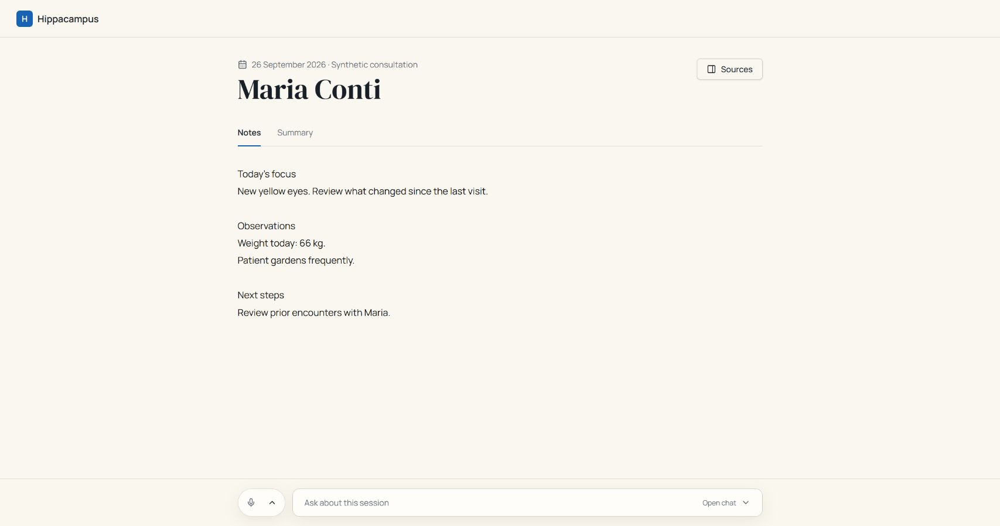

**Example:** jot down “New yellow eyes. Review what changed since the last visit,” then ask for historical context without replacing those notes with generated text. Formatting is available during the session; browser persistence currently restores plain text.

### 2. Every citation opens the original passage

Chat requests include the current notes and completed live transcript segments. The local service searches seeded history and imported sources, then returns quoted passages with numbered citations. Citation colours distinguish notes, transcripts, EHR records and medical references.

Click a citation to open the Record viewer, scroll to the original text and highlight the passage. Its source date, document title and transcript timestamp remain visible.

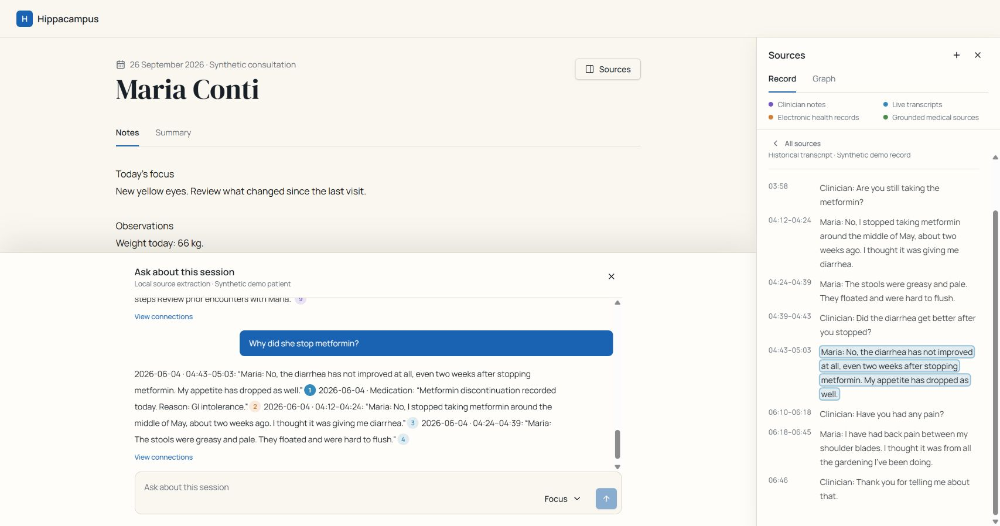

**Example:** the highlighted June passage says the diarrhea had not improved after stopping metformin. Inspect the surrounding dialogue rather than relying on an isolated paraphrase.

### 3. A graph that explains where the answer came from

Choose **View connections** on any answer, or open the right panel's **Graph** tab. The question connects to the documents actually cited by that answer. Select a node to inspect its passages, then choose **Open original passage** to return to the Record viewer.

Graph and Record share the same **26rem / 416px** desktop panel. It stays collapsible; asking a question does not automatically open it. Connections represent citation provenance, not clinical causation or diagnostic certainty.

The [overview screenshot](docs/screenshots/00-overview.jpg) shows the June written note and historical call connected to one question. A weight-history question brings several encounters into view:

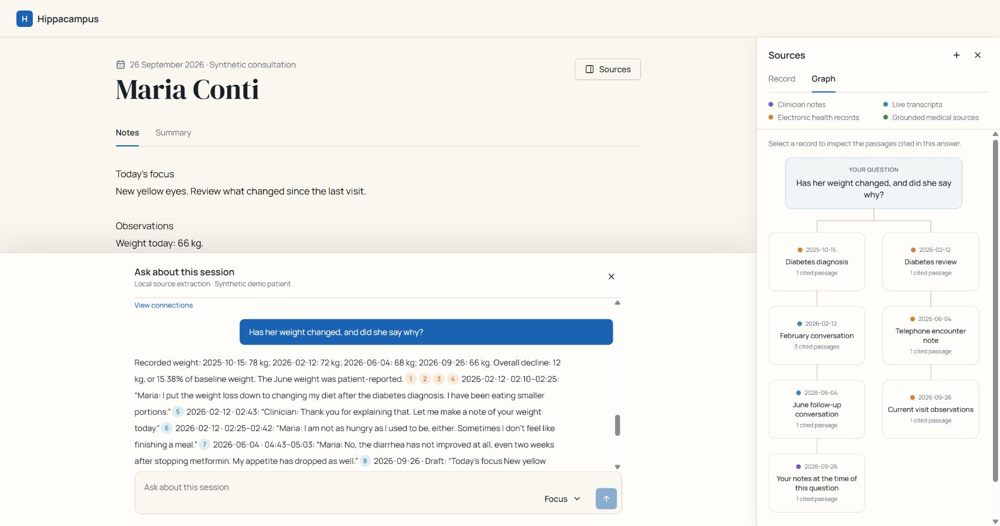

**Example:** follow a measurement back to its EHR record, then inspect the separate conversation in which Maria explained her appetite and diet.

### 4. Browse a source library, not an opaque answer

The Record tab lists dated documents with their source type. EHR entries remain separate from transcripts and working-note snapshots, preserving the distinction between what was written in the chart and what was said.

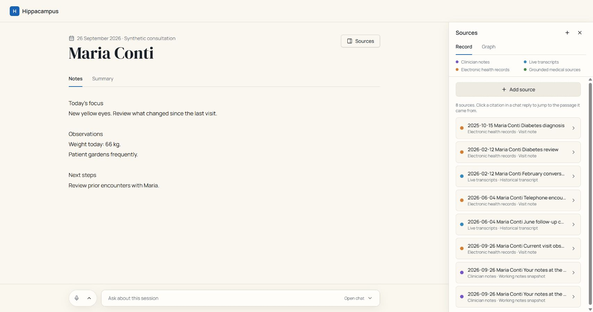

**Example:** open the June encounter note, read “GI intolerance,” then open the June conversation for the additional detail. Old answers retain the snapshots used when they were created, even after the current draft changes.

### 5. Bring additional context into the conversation

Use **Sources → Add source** to upload a text file or paste text. Give it a title and category. Imported text is saved locally, given stable passage identifiers, and made available to subsequent questions.

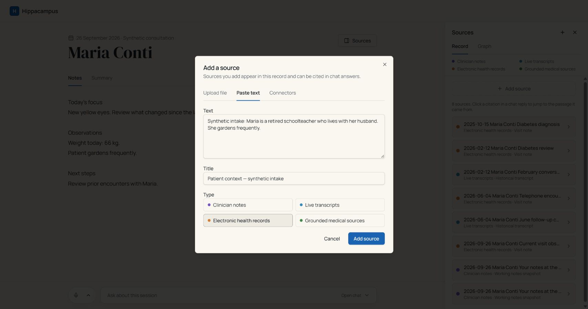

**Example:** add a fictional intake note titled “Patient context — synthetic intake,” then ask what the records say about gardening. Text upload and paste are implemented; PDF, image and DICOM parsing are not part of this branch.

### 6. Review a session recap on request

The Summary tab collects current notes and completed transcript passages. Generate or regenerate it when useful; background activity does not overwrite the notes editor.

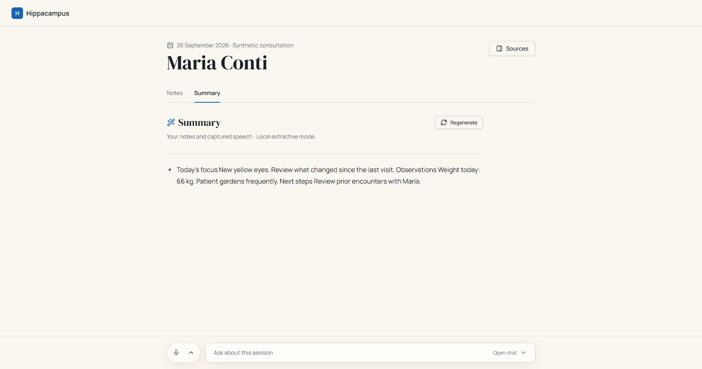

**Current behaviour:** this is an extractive recap, not an LLM-written clinical summary. With notes alone, it returns the draft as an excerpt; completed speech adds transcript excerpts.

### 7. Capture speech locally with Whisper

The existing microphone path sends five-second audio chunks through the app to a local **whisper.cpp** server. It downsamples to 16 kHz mono WAV, skips silent chunks, and uses voice-activity detection and transcript cleanup. Completed segments become available to chat when a question is submitted.

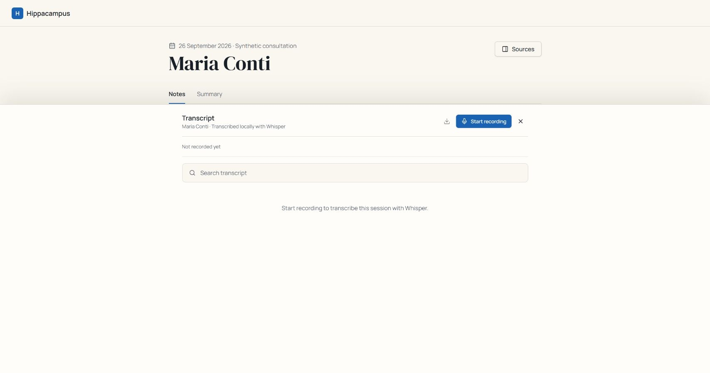

With the separate Whisper service running, the interface supports start/pause/resume, elapsed time, timestamped passages, transcript search and **WebVTT download**. This screenshot intentionally shows the unrecorded state; it is not evidence of a live recording test.

The recorder captures microphone input. It does not automatically capture remote telehealth participants, and live speech is not diarized by speaker. Historical dialogues are labelled synthetic fixtures.

### 8. Keep evidence usable on smaller screens

On narrow screens, the same source panel becomes a full-width overlay with a close control. The graph retains compact nodes and source selection rather than becoming a separate dashboard.

<p align="center">
  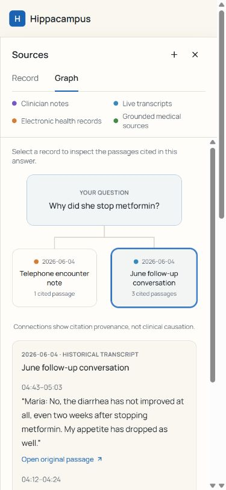
</p>

<details>
<summary><strong>Connector preview — planned integrations</strong></summary>

The connector picker shows Epic, Oracle Health, Microsoft Teams, UpToDate and PubMed with **Coming soon** labels. These are interface previews, not active connections.

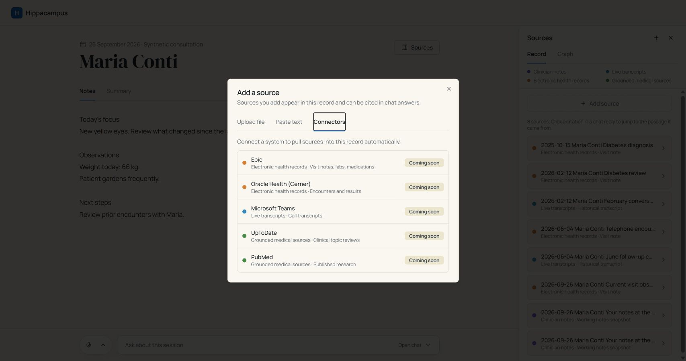

BioThings Explorer and Bedrock integration are also planned backend work. Neither powers the current local answers.

</details>

## What works today

| Capability                                               | Status in this branch                                                                                                     |
| -------------------------------------------------------- | ------------------------------------------------------------------------------------------------------------------------- |
| Notes editor and browser-local text persistence          | Implemented                                                                                                               |
| Synthetic Maria Conti EHR and historical conversations   | Implemented                                                                                                               |
| Question-triggered passage retrieval                     | Implemented; keyword-based extraction, not open-ended LLM reasoning                                                       |
| Current notes and completed transcript as chat context   | Implemented                                                                                                               |
| Citations, original records and passage highlighting     | Implemented                                                                                                               |
| Per-answer evidence graph and source inspection          | Implemented                                                                                                               |
| Text import, document storage and saved chat turns       | Implemented                                                                                                               |
| Immutable snapshots behind prior citations               | Implemented                                                                                                               |
| Weight-history arithmetic                                | Implemented from structured fixture observations                                                                          |
| Session recap                                            | Implemented as source extraction                                                                                          |
| Microphone, local Whisper, search and WebVTT export      | Existing implementation; requires a separate Whisper server; live capture not validated on the Windows screenshot machine |
| Bedrock generation and live BioThings evidence           | Planned                                                                                                                   |
| Production EHR / collaboration-tool connectors           | Planned; picker previews only                                                                                             |
| Referral drafts, Italian summaries and follow-up actions | Planned                                                                                                                   |
| Practice-wide cohort query                               | Planned                                                                                                                   |

This branch is a local hackathon prototype with synthetic data. It does not claim diagnostic performance, production clinical readiness or HIPAA compliance.

## Run locally

### Core demo — no model credentials required

Prerequisites: **Node.js 22.12+**, **Python 3.10+**, and Git.

```sh
git clone --branch feature/clinical-workspace-showcase https://github.com/Yoha02/HIPAAcampus.git
cd HIPAAcampus
npm ci
npm run backend:install
npm run dev:local
```

Open **http://localhost:8080**. The app runs on port 8080 and FastAPI on port 8000. This starts the records/chat demo; it does **not** start Whisper.

Optionally create and activate a Python virtual environment before `backend:install`. Use that environment when starting the backend. If records are unavailable, check the backend terminal and use the visible Retry control.

### Add live transcription

The supplied setup uses Bash, CMake, a C/C++ compiler and Unix-style paths. The original instructions target macOS with Xcode Command Line Tools; Windows needs a compatible environment or a separately configured whisper.cpp server. A native Windows build has not been verified here.

```sh
git submodule update --init vendor/whisper.cpp
npm run whisper:setup
npm run whisper:server
```

Leave that process running alongside `npm run dev:local`. Setup downloads the selected Whisper and VAD models. The default transcription endpoint is **http://127.0.0.1:8178**.

`npm run dev:all` is the original app-plus-Whisper shortcut; it does **not** include the records backend. Use `dev:local` plus a separate `whisper:server` process for the full local workspace.

### Configuration and storage

| Setting              | Default                     | Purpose                                               |
| -------------------- | --------------------------- | ----------------------------------------------------- |
| `CLINICAL_API_URL`   | `http://127.0.0.1:8000`     | Server-side destination for the clinical API proxy    |
| `CLINICAL_DB`        | `backend/data/demo.sqlite3` | Imported sources, chat history and citation snapshots |
| `WHISPER_SERVER_URL` | `http://127.0.0.1:8178`     | App proxy's transcription target                      |
| `WHISPER_MODEL`      | `base.en`                   | Model selected by setup/server scripts                |
| `WHISPER_VAD_MODEL`  | `silero-v6.2.0`             | Voice-activity detection model                        |
| `WHISPER_LANGUAGE`   | `en`                        | Transcription language                                |
| `WHISPER_PORT`       | `8178`                      | Local whisper-server port                             |

The fixed encounter date is **26 September 2026**, independent of the computer's date. Sources live in `backend/fixtures.py`. Runtime SQLite data, downloaded models and local environment files are excluded from Git. Browser notes persist as plain text; earlier citations keep immutable snapshots.

## How it works

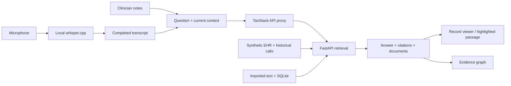

1. A submitted question carries the current draft and completed speech segments; there is no continuous background insight feed.
2. The service snapshots current context and searches historical documents and imported text. Earlier drafts remain available for past citations but are excluded from new current-context retrieval.
3. Responses include quoted passages, citation identifiers, supporting documents, and graph nodes/edges. Weight calculations use structured observations.
4. Text and graph use the same evidence contract. A graph node and a numbered citation lead to the same underlying passage.

| Layer           | Stack                                                                 |
| --------------- | --------------------------------------------------------------------- |
| Workspace       | React 19, TanStack Start/Router, TypeScript                           |
| Interface       | Tailwind CSS 4, shadcn/ui, Lucide, Vite 8                             |
| Records service | Python, FastAPI, Pydantic, SQLite                                     |
| Audio           | Browser PCM capture, WAV conversion, whisper.cpp                      |
| Evidence        | Existing document viewer, stable passage IDs, SVG-backed graph layout |

### API contract

The app proxies `/api/clinical/*` to FastAPI.

| Endpoint                    | Purpose                                                    |
| --------------------------- | ---------------------------------------------------------- |
| `GET /bootstrap`            | Patient identity, documents, fixed date and saved turns    |
| `POST /chat`                | Evidence retrieval using `{ question, notes, transcript }` |
| `POST /sources`             | Persist text and assign citable passage IDs                |
| `POST /summary`             | Extract current notes and completed transcript text        |
| App: `POST /api/transcribe` | Forward audio to local Whisper                             |

A citation is `{ sourceId, passageId }`. Chat responses include `sentences`, `sources`, `graph` and an explicit `local-extractive` mode. See [backend notes](backend/README.md) for context and persistence rules.

### Repository map

```text
backend/                         FastAPI service, fixtures and tests
src/features/meeting/
  components/notes/              Editor and formatting
  components/chat/               Questions, responses and citations
  components/sources/            Record viewer, importer and graph
  components/transcript/         Recording, search and VTT export
  components/summary/            Extractive recap
  hooks/                         Workspace state and integration
  lib/clinical-api.ts            Validated response contracts
src/routes/api/clinical/$.ts      Same-origin proxy to FastAPI
src/routes/api/transcribe.ts     Same-origin proxy to Whisper
scripts/whisper/                  Speech setup and server scripts
vendor/whisper.cpp/               Pinned speech-engine submodule
docs/screenshots/                Actual app captures
docs/DEMO.md                      Five-minute presentation script
```

## Verification

```sh
npm run backend:test
npx tsc --noEmit
npm run lint
npm run build
```

The tests cover citation resolution, graph integrity, Maria's clues, weight arithmetic, immutable snapshots, imported-source retrieval, persistence, and absence of an unspoken current plan. Browser checks cover passage highlighting, notes across tab changes, and shared Record/Graph width.

Capture conditions are documented in [the screenshot index](docs/screenshots/README.md). Screenshots use fictional records and manually entered example notes; the transcription image shows the unrecorded state.

## License

[MIT](LICENSE). The whisper.cpp submodule and other dependencies retain their own licenses.
